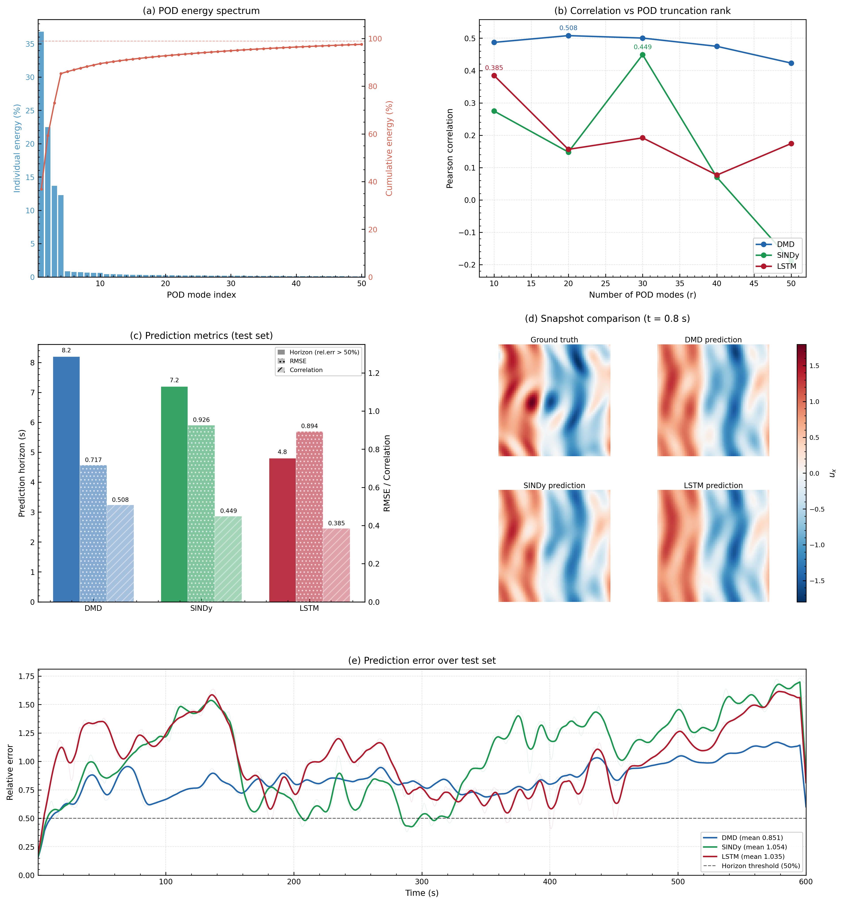

# ME5311 Project 2: Data-Driven System Modeling and Prediction

This project studies a 2D spatio-temporal chaotic vector field with strong nonlinearity and high sensitivity to initial conditions, where small perturbations can quickly amplify over time. I build a compact pipeline to reduce the state with POD, train DMD, SINDy, and LSTM predictors, and compare their forecasting performance on a dataset of shape `(15000, 64, 64, 2)` split into train, validation, and test sets.

## Algorithm Highlights

DMD is a fast and interpretable linear latent-dynamics model. It usually works well for dominant coherent structures, but its performance can degrade for strongly nonlinear long-horizon prediction. SINDy identifies sparse nonlinear equations in reduced coordinates, which improves physical interpretability, but it is sensitive to noise and to library or threshold settings. LSTM is a flexible sequence model that captures nonlinear temporal dependencies and is often stronger for short- to medium-horizon prediction, while requiring higher training cost and more hyperparameter tuning.




## Project Files
- `main.py`: full analysis pipeline entry point
- `load_data.py`: data loading and frame indexing
- `POD.py`: proper orthogonal decomposition implementation
- `DMD.py`: delay-embedded DMD predictor
- `SINDy.py`: sparse identification of dynamics in reduced space
- `LSTM.py`: LSTM-based sequence predictor
- `metrics.py`: error and skill metrics (relative error, RMSE, correlation, R2, horizon)
- `plot.py`: consolidated publication-style figure generation
- `analyze_dynamics.py`: additional diagnostic script for dynamics behavior
- `data/vector_64.npy`: input dataset (not included; place it in `data/`)
- `data/PLACEHOLDER.txt`: placeholder file for dataset directory

## Requirements
Install dependencies:

```bash
pip install -r requirements.txt
```

## Run
From the project root:

```bash
python main.py
```

## Outputs
- Figure: `output/report_figure.png`
- Text summary: `output/results_summary.txt`
